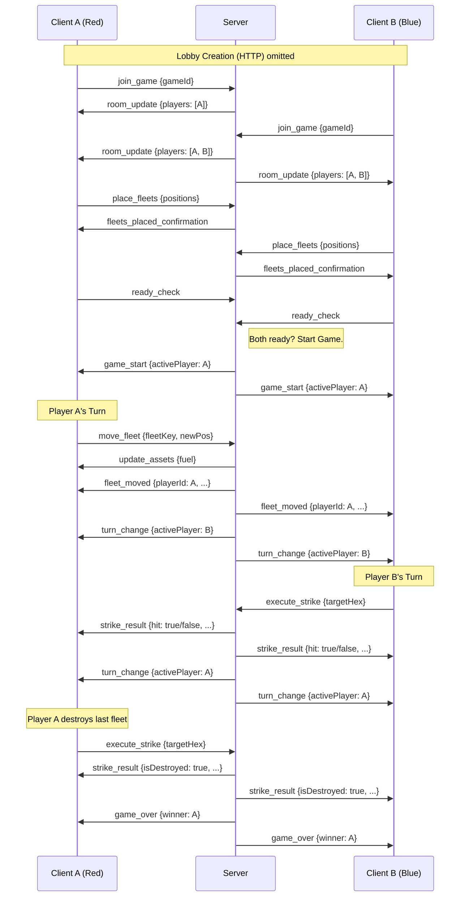

# Find, Fix, & Finish (FFF) - API Documentation

## Overview
This document describes the Socket.IO API for the "Find, Fix, & Finish" game. The game uses Socket.IO for real-time communication between clients and the server.

## Table of Contents
- [Socket Events (Client → Server)](#socket-events-client--server)
- [Socket Events (Server → Client)](#socket-events-server--client)
- [HTTP Endpoints](#http-endpoints)
- [Game Data Structures](#game-data-structures)
- [Game Flow](#game-flow)
- [Sequence Diagram](#sequence-diagram)

---

## Socket Events (Client → Server)

### 1. `join_game`
Joins a player to an existing lobby.

**Payload:**
```javascript
{
  gameId: string,    // The lobby ID to join
  playerName: string // Optional player name (defaults to "Unknown Commander")
}
```

**Errors:**
- `"Game does not exist"` - Lobby doesn't exist
- `"Lobby is full"` - Lobby already has 2 players
- `"Game has already started"` - Lobby status is not 'waiting'

**Server Response:** `room_update` event to all players in the room

---

### 2. `place_fleets`
Places the player's fleet units on the game board. Must be done before readying up.

**Payload:**
```javascript
{
  gameId: string,
  fleetPositions: {
    alpha: { q: number, r: number }, // Hex coordinates
    beta: { q: number, r: number }
  }
}
```

**Notes:**
- Each fleet starts with 2 HP (server-side)
- Server validates and sets initial HP to prevent tampering

**Server Response:** `fleets_placed_confirmation` (confirmation to sender)

---

### 3. `ready_check`
Marks the player as ready and checks if both players are ready to start.

**Payload:**
```javascript
{
  gameId: string
}
```

**Prerequisites:**
- Player must have placed their fleets
- Lobby must be in 'waiting' status

**Server Responses:**
- If both ready: `game_start` event
- Error: `"You must place your fleets before readying up."`

---

### 4. `execute_strike`
Executes a strike attack on a target hex (opponent's turn-based action).

**Payload:**
```javascript
{
  gameId: string,
  targetHex: { q: number, r: number }
}
```

**Prerequisites:**
- Game status must be 'active'
- It must be the player's turn (`activePlayer === socket.id`)

**Server Responses:**
- `strike_result` event to all players in the room
- Error: `"It is not your turn."` or `"Game is not active"`

**Strike Result Payload:**
```javascript
{
  attacker: string,           // Socket ID of attacker
  hit: boolean,                // Whether the strike hit a fleet
  targetHex: { q, r },         // Target coordinates
  fleetKey: string | null,     // "alpha" or "beta" if hit, null if miss
  hpRemaining: number | null,   // Remaining HP of hit fleet
  isDestroyed: boolean         // Whether fleet was destroyed
}
```

---

### 5. `move_fleet`
Moves one of the player's fleets to a new position.

**Payload:**
```javascript
{
  gameId: string,
  fleetKey: string,           // "alpha" or "beta"
  newPosition: { q: number, r: number }
}
```

**Prerequisites:**
- Game status must be 'active'
- It must be the player's turn
- Player must have at least 1 fuel

**Fleet Movement Rules:**
- Consumes 1 fuel unit per move
- Cannot move to hex occupied by own fleet
- Fleet must have HP > 0 to move

**Server Responses:**
- `fleet_moved` event to all players
- `update_assets` event to sender (new fuel amount)
- Error: `"Not enough fuel to move."` or `"Cannot move to a hex occupied by another friendly fleet."`

---

### 6. `leave_game`
Leaves the current game/lobby.

**Payload:**
```javascript
{
  gameId: string
}
```

**Server Responses:**
- If game was active: `game_over` event (other player wins)
- If waiting: `room_update` event
- If lobby empty: Lobby is deleted

---

### 7. `disconnect`
Automatic event when a player disconnects from the server.

**Behavior:**
- Player removed from lobby
- If game was active: Other player wins via `game_over`
- If lobby empty: Lobby is deleted

---

## Socket Events (Server → Client)

### 1. `room_update`
Sent when a player joins, leaves, or game state changes.

**Payload:**
```javascript
{
  players: {
    [socketId]: {
      name: string,
      ready: boolean,
      color: "Red" | "Blue"
    }
  },
  status: string  // "waiting" | "active" | "game_over"
}
```

---

### 2. `fleets_placed_confirmation`
Confirmation that fleet placement was successful.

**Payload:** None

---

### 3. `game_start`
Sent when both players are ready and game begins.

**Payload:**
```javascript
{
  activePlayer: string  // Socket ID of player who goes first (Red)
}
```

---

### 4. `turn_change`
Sent when the active player changes.

**Payload:**
```javascript
{
  activePlayer: string  // Socket ID of player whose turn it is
}
```

---

### 5. `strike_result`
Sent after a strike is executed.

**Payload:** (See `execute_strike` above)

---

### 6. `fleet_moved`
Sent when a fleet is successfully moved.

**Payload:**
```javascript
{
  playerId: string,
  fleetKey: string,           // "alpha" or "beta"
  newPosition: { q: number, r: number }
}
```

---

### 7. `update_assets`
Sent to update player with new resource amounts.

**Payload:**
```javascript
{
  fuel: number,       // Remaining fuel (max 3)
  fleetCube: number   // Remaining fleet cube (max 2)
}
```

---

### 8. `game_over`
Sent when the game ends.

**Payload:**
```javascript
{
  winner: string,     // Name of winning player
  winnerId: string,   // Socket ID of winner
  reason?: string     // Optional (e.g., "Opponent disconnected")
}
```

---

### 9. `error`
Sent when an error occurs.

**Payload:** `string` (error message)

---

## HTTP Endpoints

### `POST /create-lobby`
Creates a new game lobby.

**Response:**
```javascript
{
  gameId: string  // Unique lobby identifier
}
```

**Note:** This is handled in `server.js`, not `socketHandler.js`.

---

## Game Data Structures

### Lobby State
```javascript
{
  gameId: string,
  status: "waiting" | "active" | "game_over",
  players: {
    [socketId]: {
      name: string,
      ready: boolean,
      color: "Red" | "Blue"
    }
  },
  fleets: {
    [socketId]: {
      alpha: { q: number, r: number, hp: number },
      beta: { q: number, r: number, hp: number }
    }
  },
  assets: {
    [socketId]: {
      fuel: number,
      fleetCube: number
    }
  },
  activePlayer: string,  // Socket ID of current player
  history: [
    {
      action: "strike" | "move",
      playerId: string,
      timestamp: number,
      // For strike:
      targetHex: { q, r },
      hit: boolean,
      fleetKey?: string,
      // For move:
      fleetKey: string,
      from: { q, r },
      to: { q, r }
    }
  ]
}
```

---

## Game Flow

```
1. Player A creates lobby via HTTP POST /create-lobby
2. Player A joins via socket 'join_game'
3. Player B joins via socket 'join_game'
4. Both players place fleets via 'place_fleets'
5. Both players ready up via 'ready_check'
6. Game starts (Red player goes first)
7. Active player can:
   - Execute strike via 'execute_strike'
   - Move fleet via 'move_fleet'
8. Turn alternates via 'turn_change'
9. Game ends when all opponent fleets destroyed
```

---

## Important Notes

1. **Turn Management:** Only the `activePlayer` can perform actions
2. **HP Protection:** Fleet HP is set server-side to prevent cheating
3. **Collision Prevention:** Cannot move fleets onto hexes occupied by own fleets
4. **Disconnection Handling:** If a player disconnects during active game, the other wins
5. **Red Player:** Always goes first (designated in `ready_check`)
6. **Max Players:** 2 players per lobby
7. **Starting Resources:** 3 fuel, 2 fleet cube per player

---

## Sequence Diagram


